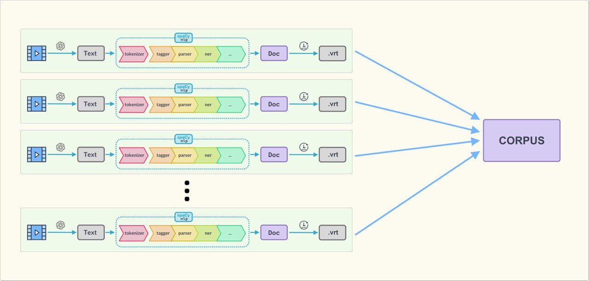

# Pipeline

Pipeline is a simple and easy tools to create vertical (.vrt) and corpus files from videos.




It rests on this tools to create the pipeline:
 - [OpenAI Whisper](https://github.com/openai/whisper): is a general-purpose speech recognition model. It is trained on a large dataset of diverse audio and is also a multi-task model that can perform multilingual speech recognition as well as speech translation and language identification.
 - [Spacy](https://spacy.io/): is a free, open-source library for Natural Language Processing in Python. It features NER, POS tagging, dependency parsing, word vectors and more.
 - [Gentle](https://lowerquality.com/gentle/): is a forced aligner for speech and text. It uses a probabilistic model to align speech to text, and is trained on a large dataset of speech and text. It is also a multi-task model that can perform multilingual speech recognition as well as speech translation and language identification.

## Usage

Take a videofile as input and generate the corresponding vrt file named `videofile.vrt` in the same directory.

<code >
  ./daedalus_pipeline.py --file <input_file>
</code>

## Installation

Install next dependencies to make it work:
### Requirements

#### **ffmpeg**


Requires the command-line tool [`ffmpeg`](https://ffmpeg.org/) to be installed on your system, which is available from most package managers:

```bash
# on Ubuntu or Debian
sudo apt update && sudo apt install ffmpeg

# on MacOS using Homebrew (https://brew.sh/)
brew install ffmpeg

# on Windows using Chocolatey (https://chocolatey.org/)
choco install ffmpeg
```

#### **Spacy models**
Requires spacy models:

<code>
python -m spacy download en_core_web_lg
</code>

#### **Some python packages**

<code >
  pip install -r requirements.txt
</code>

#### **GENTLE**

Requires to install gentle from [here](https://lowerquality.com/gentle/) and be in your path.

